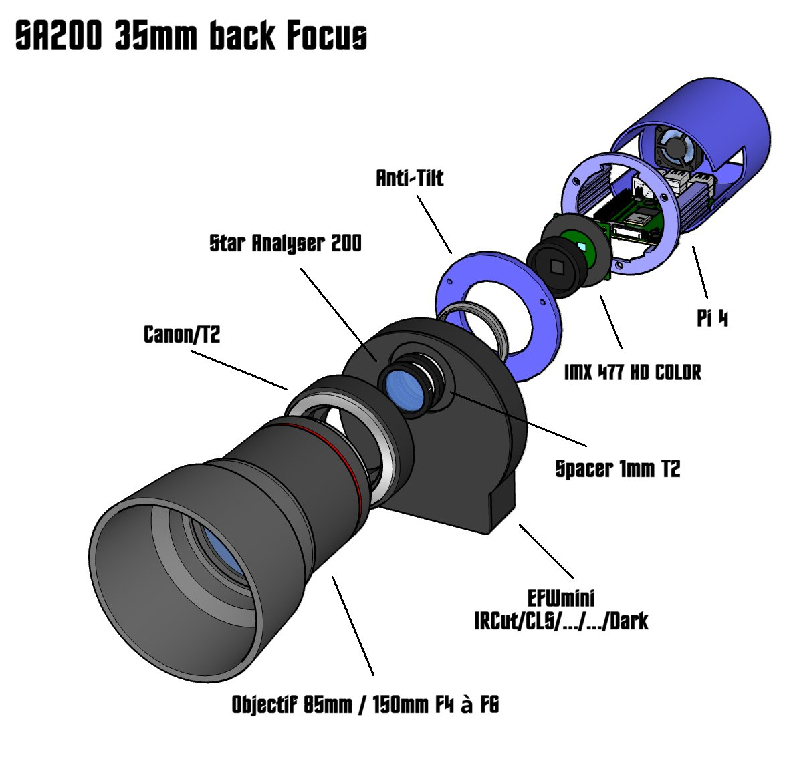
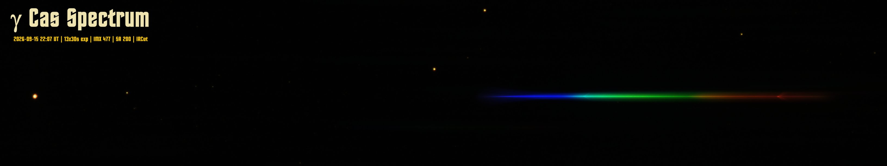

*`(Edition 17 Septembre 2026)`*
# Spectroscope Star Analyser 200 montage et tests

[D. Touzan](mailto:dtouzan@gmail.com), 

**`Résumé`**. Etude sur le montage du Star Analyser 200 avec un porte filtre ZWO EFWmini ce réseau sera monté en avant du porte filtre et la camera cmos utilisé sera la IMX477. Le **back focus** entre le réseau et la camera est d'environs **35mm**. Le test est effectué sur ***γ Cassiopée*** daté du 15 Septembre 2026 22:07 UT.

**`Mots clés`**:	*Spectroscope, Raie spectrale, Réseau, filtres* 

