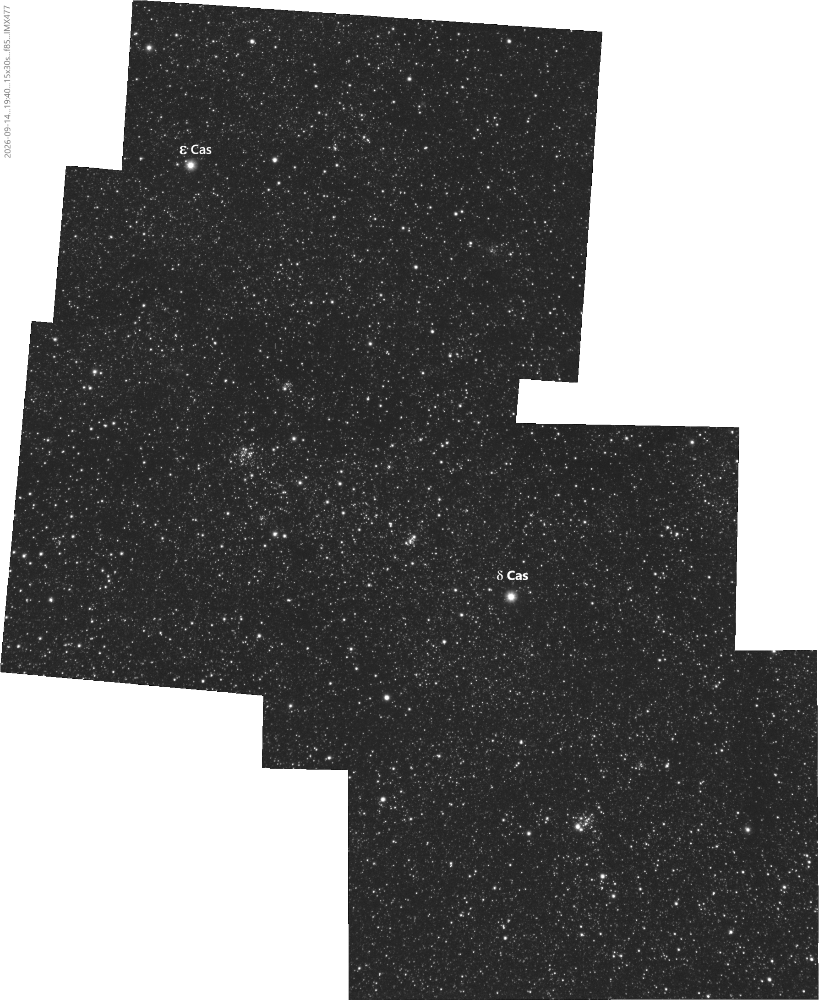

*`(Edition 18 Septembre 2026)`*
# Grand champ sur la constellation de Cassiopée, Amas ouvert, automatisme.

[D. Touzan](mailto:dtouzan@gmail.com), 

**`Résumé`**. Grand champ avec l'objectif de 85mm F/2.8, la camera IMX 477 et la monture Star Adventurer GTi. Les cibles on été programmées avec le logiciel **Carte du Ciel** et exécutées avec **CCDCiel** en automatique. Les amas visés sont **NGC 637**, **NGC 559**,**NGC 654**, **NGC 663**, **NGC 659**, **Messier 103** et **NGC 457** situés aux alentours de ***ε Cas*** et ***δ Cas***.

**`Mots clés`**:	*Constellation, Ama ouvert, automatisme*. 

