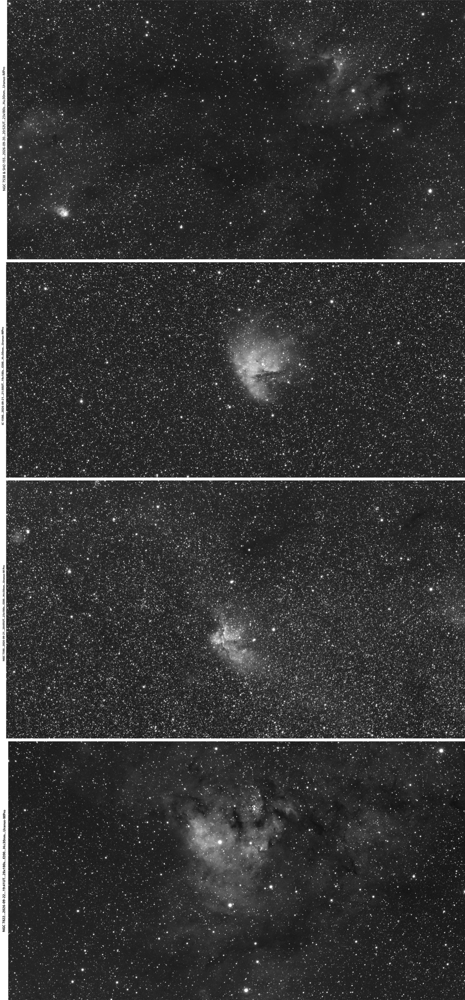

*`(Edition 28 Septembre 2026)`*

# Nébuleuse et région Hα dans la constellation de Cassiopée et Céphée.

[D. Touzan](mailto:dtouzan@gmail.com), 

**`Résumé`**. Durant la semaine 38 de l'année 2026 l'utilisation du filtre Hα 30nm avec la camera Uranus-M Pro et l'objectif de 200mm F/3.5 a confirmé le bon fonctionnement de l'instrument même avec la ***Lune*** au premier quartier. La constellation de ***Cassiopée*** et ***Céphée*** sont bien observables durant cette période et le choix des cibles se porta sur des nébuleuses intéressantes et bien connues de cette région, elles comportent aussi des amas ouverts qui ont été imagés en couleur avec l'ojectif de 85mm F/2.8 et la camera IMX477. Les diférentes nébuleuses sont **NGC 7538** et **SH 2-155** situées au Nord-Ouest de ***β Cas***, **IC 1590** située à l'Est de ***α Cas***, **IC 63** et **IC 59** tout près de ***γ Cas*** et **NGC 7822** bien au nord de ***β Cas***.

**`Mots clés`**:	*Nébuleuse Hα, Ama ouvert, Région Hα*. 

